# AI Digital Twin & What-If Simulation Platform

A full-stack agentic AI platform that models a small distributed e-commerce system as a **digital twin** and uses an LLM-based agent to investigate it: check health, trace blast radius, run deterministic what-if simulations, and recommend recovery actions — grounded in live system state and a retrieval-augmented knowledge base of runbooks and incident reports.

This project creates a digital representation of a distributed backend system and uses an AI agent to understand system state, investigate incidents, retrieve operational knowledge, and simulate possible failures. It solves a problem every SRE/on-call engineer knows: when something goes wrong, the useful answers ("what's affected", "what does the runbook say", "what would happen if I did X") are scattered across dashboards, wikis, and institutional memory. This platform puts one conversational interface in front of all three, while keeping the parts that must be trustworthy — metrics, simulation outcomes, incident records — entirely outside the LLM's control.

## What is this project?

A **digital twin** here just means: a live, queryable model of a real (in this case, simulated) system's services, their dependencies, their health, and their history — kept in a real database, not just a diagram. On top of that model sits an **agentic AI service** that can answer operational questions about it.

Concretely, the twin models a 5-service e-commerce backend:

```
order-service
 ├── user-service
 ├── inventory-service
 ├── payment-service
 └── notification-service
```

If `payment-service` becomes unhealthy, an operator typically needs to answer several questions at once: What's actually wrong with it right now? Which other services could be affected? Has this happened before? What would happen if it failed completely, or if traffic to it tripled? And what does the runbook say to do about it?

This application answers all five from one place: the first two and the fourth come from live tool calls and a deterministic simulation engine (never the LLM's own guess), the third comes from a real incident history, and the last comes from retrieval over a knowledge base of runbooks — with an LLM (Llama, via Groq) doing the planning and explaining, never the calculating.

## Key features

Everything below is implemented and runnable today — nothing here is a planned or future feature.

- **Service topology & dependency graph** — 5 seeded services with real dependency/dependent edges, rendered as a clickable graph in the frontend and resolvable via the API (`GET /api/services/:name`).
- **Service health & metrics** — each service carries a live health snapshot (status, p50/p99 latency, error rate, traffic) plus a time-series `servicemetrics` history.
- **Events** — a timeline of service lifecycle/operational events, filterable by service.
- **Incidents** — a real incident log (`incidents` collection) with severity/status, filing gated to the `OPERATOR` role.
- **Deterministic what-if simulations** — 8 pure, unit-tested TypeScript functions (service failure, traffic increase, database failure, cache failure, high latency, high error rate, blast radius, bottleneck detection) that compute hypothetical outcomes over the real topology — never estimated by the LLM.
- **AI assistant** — a chat interface over a single orchestrator agent that decides, per question, whether it needs live data, a simulation, retrieved documentation, several of those, or none at all.
- **Backend tool calling** — 18 internal HTTP endpoints the agent calls as "tools," grouped into enforced privilege tiers (read-only, simulation, privileged-safe, privileged-mutating).
- **RAG knowledge retrieval** — a `search_knowledge_base` tool backed by chunked/embedded runbooks, architecture docs, and incident writeups in Qdrant.
- **Agent execution traces** — every agent invocation is persisted (question, every tool/RAG step with arguments/results/timestamps, retrieved sources, final answer) and browsable via its own API and UI.
- **Authentication & RBAC** — JWT auth, bcrypt-hashed passwords, three roles (`USER`/`OPERATOR`/`ADMIN`) enforced on real routes.
- **Caching** — a Redis cache-aside layer in front of the hot `GET /api/services` read.
- **Kafka event backbone** — a real producer → topic → consumer → dead-letter-queue pipeline, proven end-to-end on a diagnostic topic (see the [Kafka](#kafka) section for exactly what's wired today vs. declared for later).
- **Reliability patterns** — retries with backoff, circuit breakers (both cross-service HTTP boundaries and the Groq call), Redis-backed rate limiting, Redis-backed idempotency, Kafka DLQ, and hard caps on the agent's own iteration count and per-tool timeout.

## Architecture

A developer should be able to understand the whole system from this diagram alone: a browser only ever talks to the Node backend; the Node backend owns every real data store; the AI service reaches live data *only* by calling the Node backend back over HTTP, and never touches MongoDB, Redis, or Kafka directly; and the AI service's own knowledge store (Qdrant) is separate from the backend's data entirely.

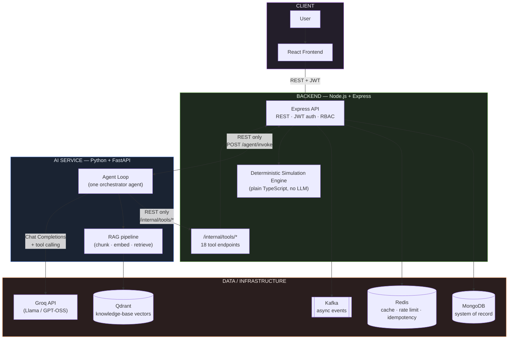

Two rules make this diagram trustworthy rather than aspirational, and both are structural in the code, not just documented: **React has exactly one function capable of making an HTTP request** (`frontend/src/api/client.ts`'s `apiFetch()`), and it only ever calls the Node backend. **The Python AI service has no MongoDB/Redis/Kafka client anywhere in its codebase** — every piece of live data it ever sees has already passed through the backend's own validation, auth, and business logic via a plain HTTP call.

The **RAG side** is a second, separate pipeline the AI service owns entirely on its own:

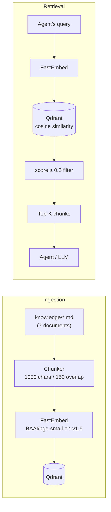

And **simulation is never the LLM's job** — it's plain, deterministic TypeScript the backend runs and hands back as structured data:

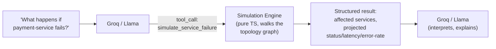

## Component responsibilities

| Component | Responsibility | Why it is used |
|---|---|---|
| **React frontend** | Renders every view (overview, topology, service detail, assistant, simulation, incidents, execution traces). The only part of the platform a person directly looks at. | React 19 + Vite for a fast, typed, component-based UI; talks to the backend through one single `fetch()` wrapper so "React never calls Mongo/Redis/Kafka/Qdrant/Groq directly" is a structural fact, not a convention. |
| **Node.js + Express backend** | Owns the digital twin's system of record: REST API, auth, MongoDB persistence, Redis caching, Kafka producing/consuming, the deterministic simulation engine, and the internal tool endpoints the AI service calls. | Express is a minimal, well-understood HTTP layer; TypeScript gives the data model (services/metrics/events/incidents/users/executions) real compile-time shape across a codebase this size. |
| **MongoDB** | Durable system-of-record data: services, topology, metrics history, events, incidents, users, agent execution traces. | Document shape fits this domain well (nested health snapshots, variable-length step arrays) without a rigid relational schema; Mongoose gives schema validation and indexes on top of that flexibility. |
| **Redis** | Cache-aside for the hot service list, fixed-window rate limiting, and request idempotency. Never the only place any data lives. | Sub-millisecond reads for data that's read far more than it's written; every use here fails open (falls back to Mongo, or lets the request through) if Redis is unreachable, so it can only make the app slower, never break it. |
| **Kafka** | Asynchronous, decoupled event delivery inside the backend, proven with a real producer → topic → consumer → DLQ pipeline. | Demonstrates a real broker-backed pub/sub mechanism (consumer groups, partitioning, dead-letter handling) as the substrate future domain events (service state changes, agent lifecycle) will ride on, independent of request/response REST traffic. |
| **Python + FastAPI AI service** | Owns the agent loop end-to-end: talks to Groq, decides which tools/RAG to use, executes them, and returns a final answer plus a full trace. | Python has the strongest ecosystem for LLM/embedding tooling (`httpx`, `fastembed`, `qdrant-client`); FastAPI gives a typed, async HTTP boundary matching the backend's own request/response style. |
| **Groq (Llama / GPT-OSS)** | Reasoning, planning, tool selection, and natural-language explanation. Never the source of truth for a number. | Groq serves open models (Llama, GPT-OSS) at very low inference latency, which matters for a multi-iteration tool-calling loop where the model may be called several times per question. |
| **Qdrant** | Vector similarity search over embedded knowledge-base chunks. Not a general-purpose database — stores no application/system data. | Purpose-built vector search (HNSW index, payload filtering) rather than bolting approximate search onto MongoDB; keeping it entirely separate from MongoDB also keeps "what the agent can cite" cleanly separate from "what the system of record contains." |
| **FastEmbed + BAAI/bge-small-en-v1.5** | Turns knowledge-base text and queries into 384-dimension vectors, locally. | ONNX-based, CPU-only, no PyTorch/GPU dependency and no paid embedding API — a ~130MB model that's fully sufficient for a knowledge base this size, run entirely for inference (no training/fine-tuning, per this project's own ground rules). |
| **JWT (jsonwebtoken)** | Stateless authentication for every user-facing API route except registration/login. | No database lookup per request — just signature and expiry verification — which keeps auth cheap on every request without adding a session store. |
| **bcryptjs** | Password hashing at registration; verification at login. Plaintext is never stored or logged. | Industry-standard adaptive hashing (cost factor 10) that's deliberately slow to brute-force, with no native-binary build step to manage. |

## System data model

MongoDB is the system of record, reached only through Mongoose from the Node backend. Six collections carry all persistent application data:

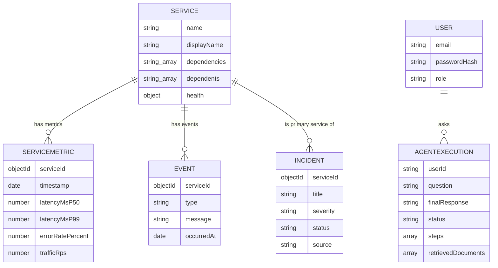

- **`services`** — the topology node for each service: name, type, description, `dependencies` (the single source of truth an operator/seed script sets), `dependents` (always *derived* from every other service's `dependencies` and re-persisted — structurally impossible to drift out of sync), and a `health` snapshot (status, p50/p99 latency, error rate, traffic). Indexed uniquely on `name`.
- **`servicemetrics`** — a time-series-style history of health samples per service, denormalizing `serviceName` alongside the real `serviceId` relationship so list/debug queries skip a lookup. Indexed on `{serviceId, timestamp}` for "most recent N samples."
- **`events`** — a plain historical log of service lifecycle/operational events (status changes, deployments, scaling), indexed for "recent across the system" and "recent for one service."
- **`incidents`** — filed incidents with severity/status/`affectedServiceNames`, plus a `source` field (`manual` vs `agent`) reserved for when an agent-proposed incident is actually approved and created.
- **`users`** — accounts with a bcrypt `passwordHash` and a `role` (`USER`/`OPERATOR`/`ADMIN`).
- **`agentexecutions`** — one document per `POST /api/assistant/ask` call: the question, every `steps[]` entry (tool name, arguments, result, whether it was a RAG query, a real timestamp), a denormalized `retrievedDocuments[]` list, the final answer, and a derived `status`. This is the execution-trace concept made real.

## Service topology

The seeded topology is a small hub-and-spoke graph — realistic enough that a "what happens if X fails" question actually has somewhere to cascade to:

```
order-service
 ├── user-service          (no dependencies)
 ├── inventory-service     (no dependencies)
 ├── payment-service       (no dependencies — seeded degraded)
 └── notification-service  (no dependencies)
```

`order-service` is the only service with real dependencies (all four others); every other service currently has none, so `order-service` is also the only entry in every other service's derived `dependents` list. This means: a failure in `payment-service` has a **blast radius** of exactly one downstream service (`order-service`) today, and `find_bottleneck` would rank `order-service` highest (the most other services rely on it) if it were the one to fail. `payment-service` is deliberately seeded already `degraded` (elevated latency and error rate) so the topology has realistic variety from the first query rather than five identical "healthy" rows.

## Backend

The Node/Express backend is layered the same way through every resource:

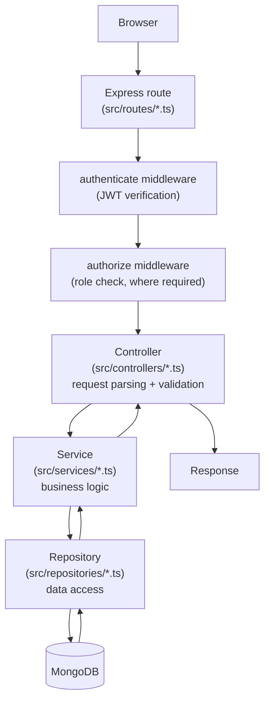

- **Routes** (`src/routes/`) mount one Express router per resource and declare exactly which middleware guards it — `app.ts` wires every mount explicitly (e.g. `app.use('/api/incidents', authenticate, incidentsRouter)`) rather than a blanket global auth rule, so the auth boundary is visible at the call site.
- **Controllers** (`src/controllers/`) parse and validate the request, call one service function, and shape the response — no business logic lives here.
- **Services** (`src/services/`) hold the actual logic: `topology.service.ts` (deriving dependents, resolving a service's graph), `auth.service.ts` (hashing, token issuance), `incident.service.ts`, `recommendation.service.ts`, `assistant.service.ts` (calls the AI service and maps its response onto a persisted execution), and the simulation engine under `services/simulation/`.
- **Repositories** (`src/repositories/`) are the only layer that touches Mongoose models directly — a deliberately dumb data-access seam.
- **Middleware** (`src/middleware/`) — `authenticate` (JWT), `authorize` (role rank check), `rateLimiter`, `idempotency`, plus request-id/logging/error-handling.
- **Tools** (`src/tools/`) — a second, parallel entry point (`/internal/tools/*`) into much of the same business logic, shaped for the AI service's tool-calling contract rather than a browser.

**Example request lifecycle** — `GET /api/services/payment-service`: Express route → `authenticate` (valid JWT required) → controller reads `req.params.name` → `topology.service.ts`'s `getServiceTopology()` → `service.repository.ts` fetches the document plus resolves `dependencies`/`dependents` to full records via two more repository calls → response `{ data: {...} }`.

## Simulation engine

The simulation engine answers "what would happen if X — without actually doing X to the running system." Every scenario is a pure, deterministic TypeScript function with zero I/O of its own (`backend/src/services/simulation/`), fed a snapshot of the real topology by the tool layer that calls it:

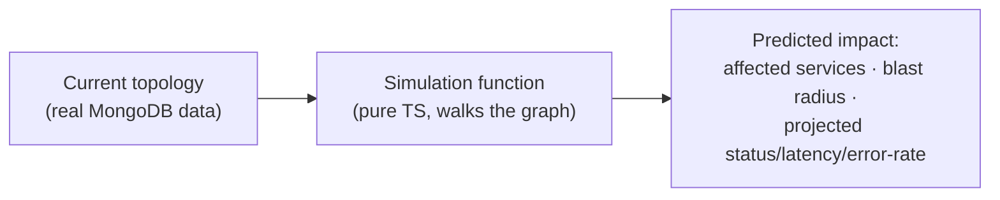

| Simulation | What it computes |
|---|---|
| `simulateServiceFailure` | Cascades a total failure to every transitive dependent of the target service. |
| `simulateTrafficIncrease` | Projects the impact of a traffic multiplier on a service and everything depending on it. |
| `simulateDatabaseFailure` | System-wide impact of the shared database failing (no target service). |
| `simulateCacheFailure` | System-wide impact of the shared cache failing (no target service). |
| `simulateHighLatency` | Propagates a latency multiplier on one service to its callers. |
| `simulateHighErrorRate` | Propagates an error-rate multiplier on one service to its callers. |
| `calculateBlastRadius` | Lists every service that transitively depends on a given service. |
| `findBottleneck` | Ranks every service by how many others would be affected if it failed, given *current* real health (not a hypothetical). |

Every function is unit-tested in isolation (`backend/tests/simulation/`) with hand-built topology fixtures, with **zero LLM involvement in the calculation itself** — Groq only ever sees the structured JSON result and explains it in words.

## AI service

The Python FastAPI service (`ai-service/`) is a separately-running process with one job: own the agent loop.

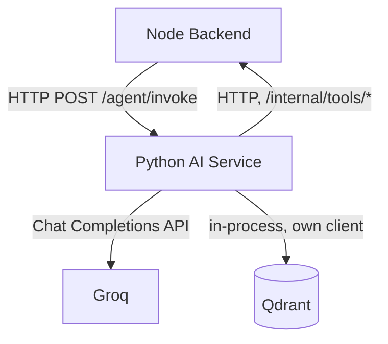

This is kept as its own service — not a module inside the Node backend — so the two very different concerns (owning system-of-record data vs. owning LLM/embedding/agent logic) stay in the language and dependency ecosystem best suited to each, and so the boundary between "the system" and "the thing reasoning about the system" is an actual process/network boundary, not just a file boundary that's easy to blur later.

Major modules:

| Module | Responsibility |
|---|---|
| `app/main.py` | FastAPI app assembly and entrypoint. |
| `app/api/agent.py` | `POST /agent/invoke` — the one endpoint the Node backend calls. |
| `app/agent/loop.py` | The orchestration loop: system prompt, the tool-calling iteration, final-answer detection. |
| `app/tools/schemas.py` | The 19 tool definitions (18 backend tools + `search_knowledge_base`) offered to Groq, tagged by privilege tier. |
| `app/tools/executor.py` | Dispatches a tool call by name; enforces privilege rules (this is where `create_incident` is intercepted). |
| `app/tools/backend_tools_client.py` | The HTTP client that calls the Node backend's `/internal/tools/*`. |
| `app/rag/loader.py`, `chunker.py`, `embedding.py`, `qdrant_client.py`, `retriever.py` | The RAG pipeline, end to end. |
| `app/llm/groq_client.py` | The only code that talks to Groq's Chat Completions API. |
| `app/clients/backend_client.py` | A second, separate backend client used for the service's own boundary-proof endpoint. |
| `app/config.py` | The one place `ai-service/.env` is loaded; every other module reads settings through it. |

## AI agent

There is **one** orchestrator agent — not a multi-agent system. It runs a single loop, offered a fixed set of tools, and decides for itself, per question, what it needs:

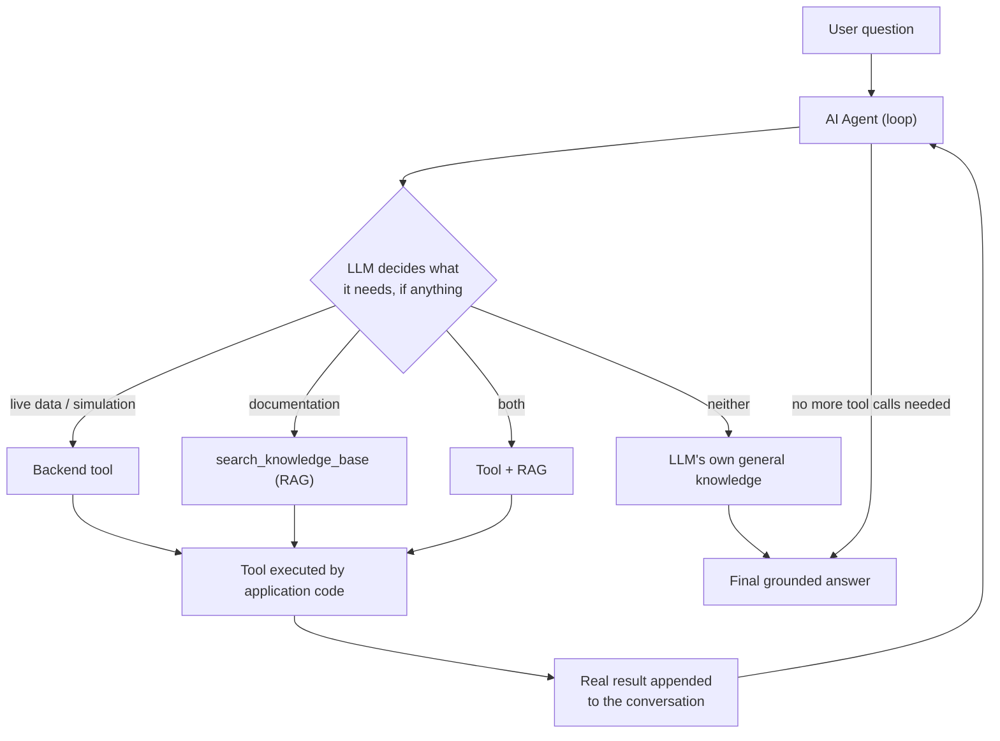

The LLM **decides which tool to call**; the application **executes** it. The loop (`run_agent()`) sends the conversation plus every tool schema to Groq; if Groq's response includes tool calls, each one is executed for real against the backend or the RAG retriever, the real result is appended back into the conversation, and the loop repeats — up to `AGENT_MAX_ITERATIONS` (6) iterations, each tool call bounded by `AGENT_TOOL_TIMEOUT_MS` (10 seconds). The LLM never executes a database query, a simulation, or a vector search itself — it only ever receives results that already happened.

## Tools

19 tools total are offered to the LLM: 18 reach the Node backend's `/internal/tools/*`; one (`search_knowledge_base`) never leaves the AI service.

**Read-only backend tools** — `get_services`, `get_service`, `get_dependencies`, `get_dependents`, `get_service_metrics`, `get_recent_events`, `get_incident_history`, `get_current_system_state`. Safe to call freely; read live MongoDB data through the same business logic the public API uses.

**Simulation tools** — `simulate_service_failure`, `simulate_traffic_increase`, `simulate_database_failure`, `simulate_cache_failure`, `simulate_high_latency`, `simulate_high_error_rate`, `calculate_blast_radius`, `find_bottleneck`. Read-only with respect to real system state — each computes a hypothetical outcome deterministically and mutates nothing.

**Knowledge retrieval** — `search_knowledge_base`. Calls the AI service's own retriever in-process; never crosses into the backend at all.

**Privileged tools** — two, treated very differently:

- **`recommend_scaling`** is `PRIVILEGED_SAFE`: it only ever returns a recommendation and never mutates anything, so the executor lets it run for real every time it's called.
- **`create_incident`** is `PRIVILEGED_MUTATING`: calling it does **not** create an incident. `app/tools/executor.py` intercepts every call to this tool and returns a structured `{"status": "PROPOSED_NOT_EXECUTED", ...}` response with the proposed incident details, without ever calling the backend's real `POST /internal/tools/create-incident` endpoint. This is enforced in the dispatcher itself, not by convention — a real operator has to file the incident for real through the existing `POST /api/incidents` (gated to the `OPERATOR` role). Privileged, state-mutating actions are treated this way because an LLM acting on a live operational system without a human in the loop is exactly the failure mode this boundary exists to prevent.

## RAG

**"What if the AI needs information from our own documentation?"** Live tool calls answer "what's happening right now," but a question like "what's the recovery procedure for payment-service?" needs documented operational knowledge instead — that's what retrieval-augmented generation (RAG) is for here.

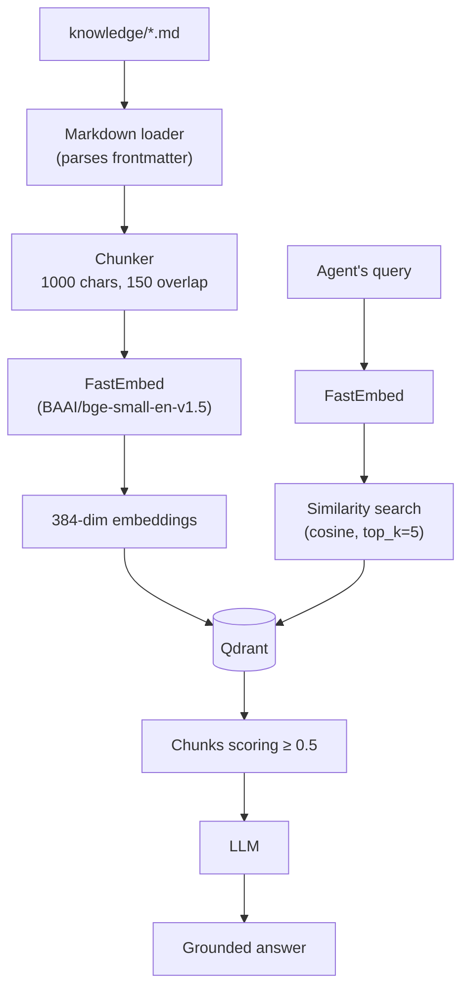

- **Chunking** — 7 real markdown documents in `knowledge/` (architecture, runbooks, incidents, troubleshooting), each split into ~1000-character chunks with 150 characters of overlap, packing whole paragraphs greedily so a chunk boundary essentially never falls mid-sentence.
- **Embeddings** — FastEmbed's `BAAI/bge-small-en-v1.5` model, run locally (ONNX, CPU-only), producing 384-dimension vectors for both documents and queries.
- **Vector database** — Qdrant, with a cosine-distance collection sized to match the embedding model's output.
- **Similarity search** — a query embedding is searched against the collection; `top_k` (default 5) sets how many candidates come back.
- **Similarity threshold** — a minimum cosine score of **0.5** filters out weak matches before anything reaches the LLM, so an unrelated chunk is never dressed up as grounding. A question the knowledge base genuinely doesn't cover returns an empty result — treated as a normal outcome, not an error.

Qdrant is kept entirely separate from MongoDB because they do different jobs: MongoDB is the system of record for the twin's own state; Qdrant only ever stores embedded knowledge-base text for similarity search. Neither can substitute for the other.

## Example AI flows

**"What is the payment-service status?"** — a pure live-data question. The agent calls `get_service` (or `get_current_system_state`), gets back the real health snapshot, and Groq turns it into a sentence. No RAG, no simulation.

**"What is the payment service recovery procedure?"**
```
AI → search_knowledge_base("payment service recovery")
   → Qdrant similarity search
   → Payment Service Recovery Runbook chunks (score ≥ 0.5)
   → LLM composes an answer from those chunks
```

**"What happens if payment-service fails?"**
```
AI → simulate_service_failure({serviceName: "payment-service"})
   → Simulation engine walks the real topology graph
   → Structured result: order-service projected down/degraded, everything else unaffected
   → LLM explains the result in words
```

**"What incidents affected payment-service?"** — the agent calls `get_incident_history`, which hits the real `incidents` collection through the backend's tool API, and Groq summarizes the returned records. No invented incidents.

**"Payment service is down, what should I do?"** — needs both: a live-state tool call (`get_service` or `get_current_system_state`) to confirm the current status, *and* `search_knowledge_base` for the recovery runbook. The agent's system prompt explicitly calls this combination out as the case where both kinds of tool are warranted in one answer.

## Execution trace

Every call to `POST /api/assistant/ask` is persisted as an `agentexecutions` document — whether the agent produced a clean final answer, hit its iteration limit, or couldn't reach Groq at all — so the platform can show *how* an answer was reached, not just the answer itself.

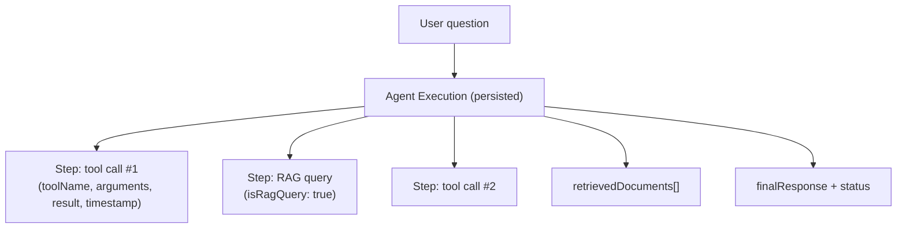

- **`executionId`** — the Mongo document's own `_id`, returned to callers as `id`.
- **`steps[]`** (`ToolCallStep` on the AI-service side) — one entry per tool call, whether it hit the backend or the RAG retriever: `toolName`, `arguments`, `result`, `isRagQuery`, and a real `timestamp` captured the instant the step completed (never invented later by whoever persists it).
- **`retrievedDocuments[]`** — denormalized out of any RAG steps at write time, so a caller can see exactly what was cited without re-parsing `steps`.
- **`status`** — derived from the AI service's `stoppedReason` (`final_answer` → `completed`, `iteration_limit` → `incomplete`, anything else → `error`), so a trace always records an honest outcome.

The backend exposes this via `GET /api/executions` (recent executions) and `GET /api/executions/:id` (one full trace), and the frontend's Execution Detail / Assistant / Simulation pages all render the same shared trace component.

## Authentication & RBAC

Authentication is stateless JWT: `POST /api/auth/register` and `POST /api/auth/login` are the only unauthenticated `/api/*` routes (`auth.service.ts`), passwords are hashed with bcrypt (10 salt rounds, never stored or logged in plaintext), and every other `/api/*` route requires a valid `Bearer` token verified by the `authenticate` middleware — no database lookup per request, just signature/expiry verification.

Authorization is a simple rank: `USER (0) < OPERATOR (1) < ADMIN (2)`, checked by the `authorize(minimumRole)` middleware, which accepts that role or higher.

| Route | Method | Auth required | Minimum role |
|---|---|---|---|
| `/api/auth/register`, `/api/auth/login` | POST | — | — |
| `/api/services`, `/api/services/:name`, `/api/services/:name/metrics` | GET | JWT | USER |
| `/api/events` | GET | JWT | USER |
| `/api/incidents`, `/api/incidents/:id` | GET | JWT | USER |
| `/api/incidents` | POST | JWT | **OPERATOR** |
| `/api/assistant/ask` | POST | JWT | USER |
| `/api/executions`, `/api/executions/:id` | GET | JWT | USER |
| `/internal/tools/*` | GET/POST | — (separate trust boundary) | — |
| `/health` | GET | — | — |

`/internal/tools/*` is deliberately outside JWT auth entirely — it's a service-to-service boundary only the AI service's own agent loop is expected to call, not user-facing RBAC, and is architecturally distinct from the three real roles above.

The three roles exist because this platform has genuinely different blast radii of action: `USER` can read everything and ask the assistant questions; `OPERATOR` can additionally file real incidents (`POST /api/incidents`) — a write with real operational consequences; `ADMIN` sits above both for future administrative actions. Self-registration currently allows choosing any of the three roles at signup — documented in the code as a demo/dev convenience (no invite/promotion flow exists yet), not a pattern a real product would ship.

## Redis / cache

**Cache-aside** is used in exactly one place today — the hot `GET /api/services` list:

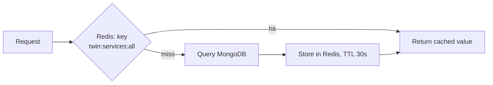

TTL is 30 seconds; there's currently no write-time invalidation path for this key (nothing writes to `services` at request time — only the seed script does), so it simply expires on its own.

Redis has two other real jobs: **rate limiting** (a Redis-backed fixed window — `INCR` + `PEXPIRE` — keyed by client IP, mounted on all of `/api/*` including `/api/auth` specifically so login/register are protected from brute-force too) and **idempotency** (opt-in via an `Idempotency-Key` header, wired only to `POST /api/incidents`: a `SET ... NX` claims the key for up to 30 seconds while the handler runs, and a completed response is cached for 24 hours so a client retry after a dropped connection replays the same response instead of filing the incident twice).

Every one of these three uses **fails open**: if Redis is unreachable, cache-aside falls back to MongoDB directly, the rate limiter lets the request through, and idempotency just runs the handler normally. Redis can only make the app slower or less-protected when it's down — never broken.

## Kafka

Kafka is wired as a real, working asynchronous-messaging backbone — producer, consumer group, explicit topic creation, and a dead-letter queue — proven end-to-end on one topic:

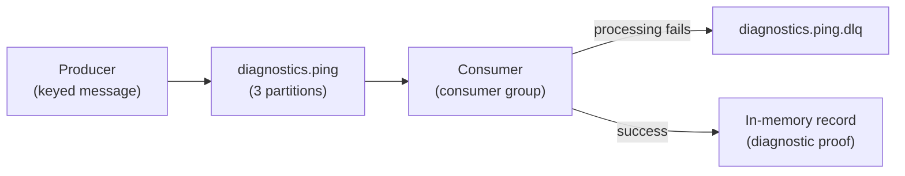

Every message carries an explicit key (Kafka routes same-key messages to the same partition, guaranteeing per-key ordering); the consumer commits its offset after every message, and republishes a message that throws during processing to a dead-letter topic instead of dropping it or retrying forever.

**Five additional topics are declared as named constants today but have no producer or consumer wired up yet** — `service.events`, `system.metrics`, `incidents`, `simulation.events`, and `agent.events` — reserved so future work imports the same topic-name constant instead of re-typing strings, but genuinely not yet in use. This README describes what's actually running, not the eventual full event backbone.

Kafka, MongoDB, and Redis are not interchangeable: **MongoDB** is persistent, queryable storage; **Redis** is a cache/coordination layer that can be wiped with no data loss; **Kafka** is for asynchronous, decoupled delivery between producers and consumers — never for request/response traffic, which stays plain REST throughout this platform.

## Reliability

| Pattern | Problem it solves | Where it's implemented |
|---|---|---|
| Retry with backoff | A connection that was never established at all (DNS failure, connection refused) shouldn't fail a whole request when a brief resend would succeed. | `backend/src/utils/retry.ts` and its Python twin `ai-service/app/utils/retry.py` — used only for connection failures, never for timeouts or non-2xx responses. |
| Circuit breaker | Without one, every call to a genuinely-down dependency pays its full timeout, repeatedly, for as long as it stays down. | `backend/src/utils/circuitBreaker.ts` / `ai-service/app/utils/circuit_breaker.py` — 3 consecutive failures trips it open, 30s cooldown before one probe call. Wrapped around backend→AI-service calls, AI-service→backend tool calls, and AI-service→Groq calls. |
| Rate limiting | Protects the public API (and specifically login/register) from being hammered. | Redis-backed fixed window, `backend/src/middleware/rateLimiter.ts`, mounted on all of `/api/*`. |
| Idempotency | A client retrying a dropped write shouldn't file the same incident twice. | Redis-backed, opt-in `Idempotency-Key` header, `backend/src/middleware/idempotency.ts`, wired to `POST /api/incidents`. |
| Kafka DLQ | A single unprocessable message shouldn't stall a partition forever. | `backend/src/kafka/consumerFactory.ts` republishes a failing message to its topic's `.dlq` topic and moves on. |
| Redis fallback | An unreachable Redis shouldn't turn into a broken app, just a slower/less-protected one. | Every Redis-dependent code path (cache-aside, rate limiter, idempotency) explicitly fails open. |
| AI iteration limit | An agent loop that never converges shouldn't run forever. | `AGENT_MAX_ITERATIONS` (default 6), enforced in `ai-service/app/agent/loop.py`. |
| AI tool timeout | One slow tool call shouldn't stall an entire agent iteration indefinitely. | `AGENT_TOOL_TIMEOUT_MS` (default 10000ms), enforced around every tool dispatch in the agent loop. |

## Project structure

```
AI-digital-twin/
├── frontend/                 React + TypeScript + Vite
│   ├── src/
│   │   ├── api/               One module per backend resource + the single fetch() wrapper
│   │   ├── auth/               AuthContext, route gating, JWT decoding for UI only
│   │   ├── components/         Markdown renderer, Sources, ExecutionTrace, layout, etc.
│   │   └── pages/               One component per view
│   └── tests/                  Mirrors src/ 1:1
├── backend/                   Node.js + TypeScript + Express
│   └── src/
│       ├── config/              env, database, redis, kafka, logger
│       ├── models/               Mongoose schemas
│       ├── repositories/         Data-access layer
│       ├── services/             Business logic + the simulation engine
│       ├── routes/, controllers/, middleware/
│       ├── kafka/                Producers, consumers, topics
│       ├── cache/                 Redis cache-aside helper
│       └── tools/                 /internal/tools/* — the AI service's tool surface
├── ai-service/                Python + FastAPI
│   ├── app/
│   │   ├── agent/                 The orchestration loop
│   │   ├── tools/                  Tool schemas, executor, backend HTTP client
│   │   ├── rag/                     Loader, chunker, embedding, Qdrant client, retriever
│   │   ├── llm/                     Groq client
│   │   └── api/                     FastAPI routers
│   └── tests/
├── knowledge/                 Markdown source documents ingested into the RAG pipeline
│   ├── architecture/, runbooks/, incidents/, troubleshooting/
├── docs/                      Architecture record, phase roadmap, env-var reference
├── tests/                     Cross-service / end-to-end tests
├── .gitignore
└── README.md                  This file
```

## Setup & running locally

This project is developed on Windows; commands below are PowerShell. No Docker or Kubernetes — every dependency runs as a plain local process.

**Prerequisites**

- Node.js 22 LTS and npm
- Python 3.11+
- MongoDB 7.x running locally
- A Redis-protocol-compatible server running locally (Redis itself, e.g. via WSL, or a Windows-native Redis-compatible server)
- Apache Kafka (with Zookeeper or KRaft), via the official binary distribution
- Qdrant running locally (binary or local server)
- A Groq API key from [console.groq.com](https://console.groq.com)

**Environment variables** — each service owns its own `.env` (never committed). Copy each `.env.example` and fill in real local values — never commit real secrets:

```powershell
cd backend
Copy-Item .env.example .env
# MONGODB_URI=<your-uri>
# REDIS_URL=<your-redis-url>
# KAFKA_BROKERS=<your-broker-list>
# JWT_SECRET=<your-secret>
# AI_SERVICE_URL=http://localhost:8000

cd ..\ai-service
Copy-Item .env.example .env
# GROQ_API_KEY=<your-key>
# BACKEND_BASE_URL=http://localhost:4000
# QDRANT_URL=<your-qdrant-url>

cd ..\frontend
Copy-Item .env.example .env
# VITE_API_BASE_URL=http://localhost:4000
```

**Start MongoDB, Redis, Kafka, and Qdrant** each in their own terminal (however you normally run them locally — each stays running for the rest of this process).

**Backend** (new terminal — stays running):
```powershell
cd backend
npm install
npm run seed     # seeds the 5-service topology + 3 demo accounts (one per role)
npm run dev       # http://localhost:4000
```

**AI service** (new terminal — stays running):
```powershell
cd ai-service
python -m venv .venv
.venv\Scripts\Activate.ps1
pip install -r requirements.txt
python -m app.rag.ingest    # chunks + embeds knowledge/ into Qdrant (one-time, re-run after editing knowledge/)
python -m app.main            # http://localhost:8000
```

**Frontend** (new terminal — stays running):
```powershell
cd frontend
npm install
npm run dev       # http://localhost:5173
```

Five terminals stay running throughout: MongoDB, Redis, Kafka, the backend, the AI service — plus the frontend's dev server for a sixth. Open `http://localhost:5173`, log in with one of the seeded demo accounts (or register your own), and the AI Assistant page is the fastest way to exercise the whole stack at once.

## API overview

All `/api/*` routes return `{"data": ...}` on success. Full detail lives in the route/controller source linked below — this is the map, not the manual.

| Group | Routes | Source |
|---|---|---|
| **Authentication** | `POST /api/auth/register`, `POST /api/auth/login` | `backend/src/routes/auth.route.ts` |
| **Services** | `GET /api/services`, `GET /api/services/:name`, `GET /api/services/:name/metrics` | `backend/src/routes/services.route.ts` |
| **Events** | `GET /api/events` | `backend/src/routes/events.route.ts` |
| **Incidents** | `GET /api/incidents`, `GET /api/incidents/:id`, `POST /api/incidents` (OPERATOR) | `backend/src/routes/incidents.route.ts` |
| **Assistant** | `POST /api/assistant/ask` | `backend/src/routes/assistant.route.ts` |
| **Executions** | `GET /api/executions`, `GET /api/executions/:id` | `backend/src/routes/agentExecutions.route.ts` |
| **Internal tool API** | 18 routes under `/internal/tools/*` (read-only / simulation / privileged) | `backend/src/tools/tools.route.ts` |
| **Health** | `GET /health` | `backend/src/routes/health.route.ts` |

## Testing

- **Backend** — Vitest, covering unit tests for the simulation engine, services, and utilities, plus integration tests (Supertest) against real local MongoDB/Redis/Kafka where practical, and a dedicated Kafka DLQ failure-injection test. Run with `npm test` from `backend/`.
- **AI service** — pytest, covering the agent loop, tool executor, RAG pipeline (loader/chunker/embedding/Qdrant/retriever), and the Groq client — the network boundary is mocked for unit tests, with a separate set of `*_live.py` tests that exercise the real Groq/Qdrant/embedding-model network path and are skipped automatically wherever that real dependency isn't reachable. Run with `pytest` from `ai-service/` (with its virtualenv active).
- **Frontend** — Vitest + Testing Library, covering the API client, auth context, the topology layout algorithm, and one test file per major page, mocking only the network boundary (`global.fetch`). Run with `npm test` from `frontend/`.
- **Cross-service** — `tests/` is reserved for end-to-end "question → agent → grounded answer" scenarios against the fully-running stack.

Exact current pass/skip counts aren't reproduced here since they drift as the suites grow — run the commands above to see them for real rather than trusting a number that can go stale.

## Security notes

- **JWT authentication** — stateless, verified on every `/api/*` request except registration/login; a missing, malformed, or expired token is rejected with a generic 401 that deliberately doesn't distinguish the failure reason.
- **RBAC** — enforced server-side by rank (`USER < OPERATOR < ADMIN`); the frontend's own role-based UI hiding is UX only, never a security boundary — a user editing their decoded token client-side gains nothing, since the real token is re-verified on the server for every request.
- **bcrypt password hashing** — passwords are never stored or logged in plaintext; only the hash is persisted.
- **AI/backend boundary** — the AI service has no database client of any kind; every piece of live data it can ever see has already passed through the backend's own auth and validation. `/internal/tools/*` is a separate, non-JWT service-to-service trust boundary, not user-facing.
- **Privileged tool handling** — `create_incident` is structurally intercepted before it can reach the backend; the agent can propose a mutating action but never execute one unsupervised.
- **Secrets** — every credential (`MONGODB_URI`, `JWT_SECRET`, `GROQ_API_KEY`, Redis/Kafka connection strings) lives only in each service's own server-side `.env`, excluded from git by `.gitignore`; the frontend receives only its backend's public base URL and nothing else.

## Why these technologies?

| Technology | Why |
|---|---|
| **React + Vite** | Fast dev/build tooling and a component model that suits a multi-view operator dashboard. |
| **Node.js + Express** | A minimal, well-understood REST layer for the system of record; TypeScript gives the whole data model real shape. |
| **MongoDB** | Persistent system-of-record data whose shape (nested health snapshots, variable-length trace steps) fits documents naturally. |
| **Redis** | Sub-millisecond cache/rate-limit/idempotency layer for data that's read far more than written — never the source of truth. |
| **Kafka** | A real, broker-backed asynchronous event mechanism, decoupled from request/response REST traffic. |
| **Python + FastAPI** | The strongest ecosystem for LLM/embedding tooling, kept as its own service so the AI boundary is a real process boundary. |
| **Groq** | Very low-latency hosted inference for open models (Llama, GPT-OSS) — important for a loop that may call the LLM several times per question. |
| **Qdrant** | Purpose-built vector similarity search, kept structurally separate from the system-of-record database. |
| **FastEmbed** | Local, CPU-only, no-GPU embedding generation with no second paid API or credential to manage. |

## Interview explanation

### 30-second explanation

"It's a digital twin of a small e-commerce backend — five services with real dependencies, health, metrics, and incidents in MongoDB — paired with an LLM agent that investigates it. The agent doesn't calculate anything itself: it calls real backend tools for live data, a deterministic TypeScript engine for what-if simulations, and a RAG pipeline over runbooks for documented procedures, then explains the results. Every agent run is fully traced and persisted."

### 2-minute explanation

"There are three services. A Node/Express backend owns all the real data — MongoDB for the system of record, Redis for caching and rate limiting, Kafka for async events — and exposes both a public REST API and a second, internal tool API the AI service calls. A Python FastAPI service runs the actual agent loop: it sends the user's question and a fixed set of tool schemas to Groq, and Groq decides which tools to call — live-data tools, simulation tools, or a RAG tool that searches an embedded knowledge base in Qdrant. The AI service executes whatever Groq asks for, by calling back into the Node backend over plain HTTP — it has no database client of its own at all, which is the one architectural rule the whole thing is built around. Results go back to Groq, which repeats until it has a final answer, bounded by an iteration cap. The Node backend persists the whole exchange — every tool call, every RAG query, the final answer — as an execution trace, so you can see exactly how the agent got there. On top of that: JWT auth with three roles, and reliability patterns — retries, circuit breakers, rate limiting, idempotency — wherever a real failure mode existed, not speculatively."

### Architecture explanation

"Walk it left to right: a user hits the React frontend, which only ever talks to the Node backend over REST with a JWT. The Node backend is the only thing that touches MongoDB, Redis, and Kafka — draw that as one box with three arrows down into a 'data & infrastructure' layer. Then draw a second arrow from the backend across to the Python AI service — that's the only connection between the two application layers, and it only goes one further hop: the AI service calls back into the backend's internal tool API, and separately calls Groq for reasoning and Qdrant for its own knowledge base. The two structural guarantees worth saying out loud: the frontend can only ever reach the backend, and the AI service can only ever reach live data by going back through the backend — it has zero direct access to Mongo, Redis, or Kafka."

### Important design decisions

- **One orchestrator agent, not a multi-agent framework** — the model itself decides, via ordinary tool-calling, whether a question needs live tools, RAG, both, or neither; there's no separate hardcoded classifier and no LangChain/CrewAI-style agent framework.
- **The AI service has no database client at all** — every fact it can ever cite has already passed through the backend's own validation and auth, by construction, not by convention.
- **Simulation is deterministic application code, never the LLM** — every what-if scenario is a pure, unit-tested TypeScript function; the LLM only interprets and explains the structured result it's handed.
- **Privileged, mutating tools are proposed, not executed** — `create_incident` is intercepted in the tool executor itself so an agent can never silently create real operational records.
- **Every reliability pattern targets a concrete, identified failure mode** — retries, circuit breakers, rate limiting, and idempotency were each added where an audit found a real gap, not applied everywhere speculatively.
- **Real infrastructure dependencies throughout, never faked** — MongoDB, Redis, Kafka, and Qdrant are always real, running processes in application code; no in-memory or local-mode stand-ins outside of tests.
