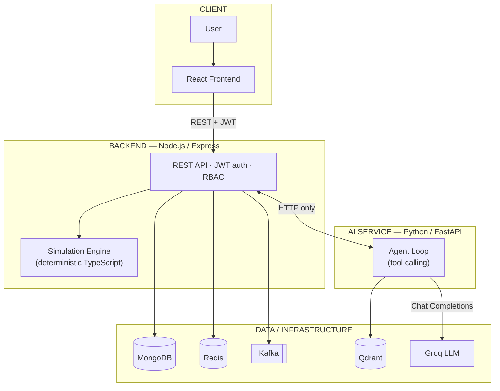

# AI Digital Twin

An AI-powered digital twin for a distributed e-commerce backend. The platform models services, dependencies, health, metrics, and incidents in a real database, and pairs that live model with an AI assistant that can investigate current system state, retrieve operational knowledge via RAG, and run deterministic what-if simulations — all grounded in real data, never invented by the LLM.

---

## Overview

A **digital twin**, in this project, is a live, queryable model of a system — five e-commerce services, their dependency graph, health, metrics, and incident history — kept in MongoDB rather than a diagram. On top of that model sits a single AI agent that can answer operational questions about it: what's wrong, what's affected, what happened before, what would happen under a hypothetical failure, and what the runbooks recommend.

It solves a familiar on-call problem: the answers to those questions are normally scattered across dashboards, a wiki, and institutional memory. This platform puts one conversational interface in front of all three, while keeping anything that must be trustworthy — metrics, simulation outcomes, incident records — entirely outside the LLM's control. It's built for anyone investigating a distributed system's behavior: an SRE, a backend engineer, or someone evaluating how an LLM agent can be wired safely into real infrastructure.

---

## Key Features

- Service topology & dependency graph
- Live health and metrics per service
- Incident logging with role-gated creation
- Deterministic what-if simulations (8 scenarios)
- AI assistant with a single orchestrator agent
- Backend tool calling across enforced privilege tiers
- RAG retrieval over runbooks and architecture docs
- Persisted, browsable agent execution traces
- JWT authentication with USER / OPERATOR / ADMIN roles
- Redis caching, rate limiting, and idempotency
- Kafka-backed asynchronous event messaging
- Retry, circuit-breaker, and timeout reliability patterns

---

## Architecture



React only ever talks to the Node backend. The Node backend owns every data store. The Python AI service reaches live data **only** by calling the Node backend over HTTP — it has no MongoDB/Redis/Kafka client of its own. Qdrant is the AI service's own knowledge store, separate from application data. Simulations are computed by deterministic TypeScript, never by the LLM.

---

## How It Works

1. The user interacts with the React frontend.
2. React calls the Node backend over REST.
3. The backend serves live digital-twin data from MongoDB (cached where hot).
4. A question for the assistant is forwarded to the AI service.
5. The agent decides whether it needs backend tools, RAG, simulation, or a combination.
6. Backend tools return live system information.
7. RAG retrieves relevant chunks from Qdrant when documentation is needed.
8. Deterministic simulations compute hypothetical outcomes when asked.
9. Groq turns the results into a final natural-language response.
10. The backend persists the full execution trace.

---

## AI Agent

One orchestrator agent — not a multi-agent system — decides per question what it actually needs, then calls it for real:

```
User Question
      ↓
   AI Agent
      ↓
LLM decides what it needs
      ↓
 ┌────┼──────────┐
 ↓    ↓          ↓
Tools RAG   Simulation
 └────┼──────────┘
      ↓
  Real results
      ↓
  Final answer
```

The LLM only ever chooses which tool to call; the application executes it and feeds the real result back. This repeats, bounded by an iteration cap, until Groq produces a final answer. The LLM never queries a database, runs a simulation, or searches Qdrant itself.

---

## RAG

RAG answers questions a live tool call can't: "what does the runbook say?" Knowledge documents (architecture notes, runbooks, incident writeups) are chunked, embedded, and searched by similarity:

```
Knowledge Documents → Chunking → FastEmbed → Qdrant → Similarity Search → Relevant Context → LLM Answer
```

Embeddings are generated locally with **FastEmbed** (`BAAI/bge-small-en-v1.5`), so no external embedding API or GPU is required. **Qdrant** stores and searches the resulting vectors by cosine similarity, and only chunks above a relevance threshold are passed to the LLM — an irrelevant match is never dressed up as grounding.

---

## What-If Simulation

Simulations answer "what would happen if something changed?" — without changing anything for real. Implemented scenarios: service failure, traffic increase, database failure, cache failure, high latency, high error rate, blast-radius calculation, and bottleneck detection.

**These calculations are deterministic TypeScript logic, not LLM-generated guesses.** The LLM only explains a structured result it's handed.

---

## Data & Infrastructure

| Component | Purpose |
|---|---|
| MongoDB | System of record for services, metrics, incidents, users, and execution traces |
| Redis | Cache, rate limiting, and request idempotency |
| Kafka | Asynchronous event messaging |
| Qdrant | Vector search for RAG |
| Groq | LLM inference |

MongoDB is durable storage; Redis is a fast, disposable cache/coordination layer; Kafka is for asynchronous delivery, not request/response traffic; Qdrant stores only embedded knowledge-base vectors, never application data.

---

## Security

- **JWT authentication** on every user-facing route except registration/login
- **bcrypt** password hashing — plaintext is never stored
- Three roles — **USER / OPERATOR / ADMIN** — enforced server-side by rank
- Privileged, state-mutating AI actions (e.g. creating an incident) are **proposed, not executed** by the agent
- All secrets live only in each service's own environment variables, never in source or sent to the frontend

---

## Project Structure

```
AI-digital-twin/
├── frontend/       React + TypeScript UI
├── backend/        Node.js + Express API, data stores, simulation engine
├── ai-service/     Python + FastAPI agent, RAG, Groq integration
├── knowledge/      Source documents ingested into the RAG pipeline
├── docs/           Architecture, phases, and environment-variable reference
├── tests/          Cross-service / end-to-end tests
└── README.md       This file
```

Each service (`frontend`, `backend`, `ai-service`) is self-contained with its own dependencies and `.env`.

---

## Tech Stack

| Layer | Technology |
|---|---|
| Frontend | React + TypeScript + Vite |
| Backend | Node.js + Express + TypeScript |
| Database | MongoDB + Mongoose |
| Cache | Redis + ioredis (e.g. Memurai on Windows) |
| Messaging | Apache Kafka + KafkaJS |
| AI Service | Python + FastAPI |
| LLM | Groq (configurable model) |
| Embeddings | FastEmbed |
| Vector DB | Qdrant |
| Auth | JWT + bcrypt |

---

## Running Locally

Prerequisites: Node.js 22+, Python 3.11+, and local instances of MongoDB, a Redis-compatible server, Kafka, and Qdrant. No Docker is required.

```powershell
# 1–4: start MongoDB, Redis/Memurai, Kafka, and Qdrant however you normally run them

# 5: backend
cd backend
Copy-Item .env.example .env   # set MONGODB_URI=<your-uri>, JWT_SECRET=<your-secret>, etc.
npm install
npm run seed
npm run dev                    # http://localhost:4000

# 6: AI service
cd ai-service
python -m venv .venv; .venv\Scripts\Activate.ps1
pip install -r requirements.txt
Copy-Item .env.example .env   # set GROQ_API_KEY=<your-key>
python -m app.rag.ingest       # embeds knowledge/ into Qdrant
python -m app.main             # http://localhost:8000

# 7: frontend
cd frontend
npm install
npm run dev                    # http://localhost:5173
```

---

## Testing

```powershell
cd backend && npm test        # unit + integration
cd ai-service && pytest        # unit + live tests (live tests skip without real Groq/Qdrant access)
cd frontend && npm test        # component tests
```

---

## Documentation

This README is the map, not the manual. For deeper implementation details, see:

- [`docs/architecture.md`](docs/architecture.md) — full system architecture and design decisions
- [`docs/phases.md`](docs/phases.md) — the phase-by-phase build roadmap
- [`docs/env-vars.md`](docs/env-vars.md) — every environment variable, per service
- [`backend/README.md`](backend/README.md), [`ai-service/README.md`](ai-service/README.md), [`frontend/README.md`](frontend/README.md) — per-service setup, design notes, and verification history
- [`knowledge/README.md`](knowledge/README.md) — the RAG knowledge base's document format

---

## Interview Summary

### 30-second explanation

This is a digital twin of a small e-commerce backend — five services with real dependencies, health, and incidents modeled in MongoDB — paired with an AI agent that investigates it. The agent never calculates anything itself: it calls real backend tools for live data, a deterministic TypeScript engine for what-if simulations, and a RAG pipeline over runbooks for documented procedures, then uses an LLM purely to explain the results. Every agent run is fully traced and persisted, and the AI service is architecturally boxed in — it can only reach live data by calling back through the backend's own API.
