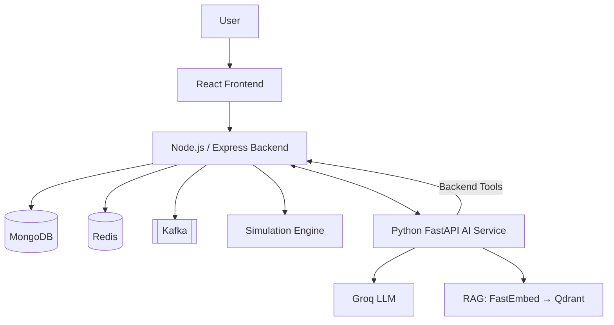

# AI Digital Twin

An AI-powered digital twin for a distributed e-commerce backend. It models services, dependencies, health, and incidents in a real database, and pairs that live model with an AI assistant that investigates system state, retrieves operational knowledge via RAG, and runs deterministic what-if simulations.

---

## How it works



React only talks to the Node backend, and the backend owns every data store. The AI service reaches live data only by calling the backend's HTTP tool API — it has no direct database access. Simulations are computed by deterministic TypeScript, never by the LLM, and RAG retrieval runs against Qdrant, separate from application data.

---

## Key Features

- Service topology and dependency graph
- Live service health and metrics
- AI assistant with tool calling
- RAG over runbooks and architecture documents
- Deterministic what-if simulations
- Incident management
- Agent execution traces
- JWT authentication and RBAC
- Redis caching and rate limiting
- Kafka-based messaging

---

## Tech Stack

| Layer | Technology |
|---|---|
| Frontend | React, TypeScript, Vite |
| Backend | Node.js, Express, TypeScript |
| Database | MongoDB, Mongoose |
| Cache | Redis, ioredis |
| Messaging | Apache Kafka, KafkaJS |
| AI Service | Python, FastAPI |
| LLM | Groq |
| RAG | FastEmbed, Qdrant |
| Auth | JWT, bcrypt |

---

## Setup

### Prerequisites
- Node.js 22+, Python 3.11+
- Local MongoDB, Redis-compatible server, Kafka, and Qdrant

### Backend
```powershell
cd backend
npm install
npm run seed
npm run dev        # http://localhost:4000
```

### AI Service
```powershell
cd ai-service
python -m venv .venv; .venv\Scripts\Activate.ps1
pip install -r requirements.txt
python -m app.rag.ingest   # embeds knowledge/ into Qdrant
python -m app.main          # http://localhost:8000
```

### Frontend
```powershell
cd frontend
npm install
npm run dev         # http://localhost:5173
```

---

## Environment Variables

Each service has its own `.env.example`. Never commit real values.

```
MONGODB_URI=<your-uri>
REDIS_URL=<your-redis-url>
KAFKA_BROKERS=<your-broker-list>
JWT_SECRET=<your-secret>
GROQ_API_KEY=<your-key>
QDRANT_URL=<your-qdrant-url>
```

---

## Testing

```powershell
cd backend && npm test
cd ai-service && pytest
cd frontend && npm test
```

---


