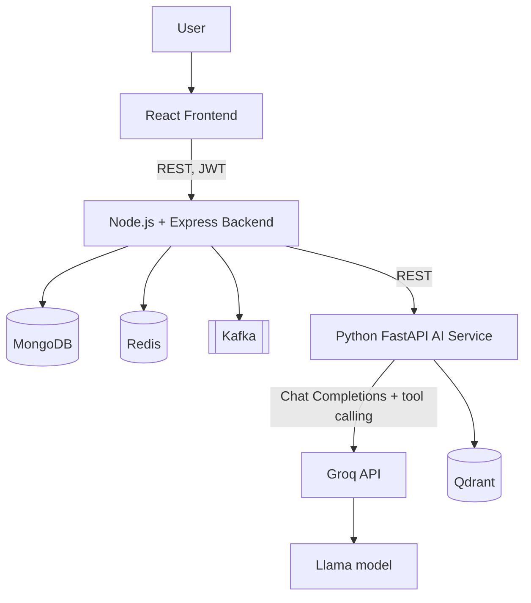
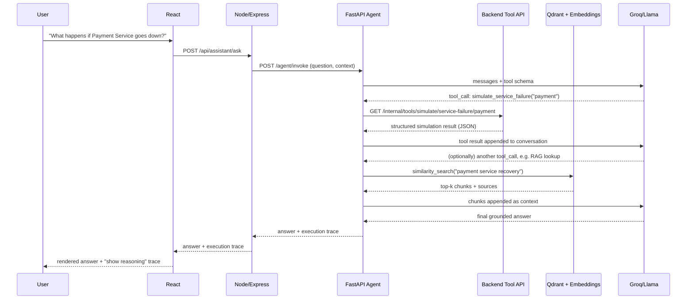
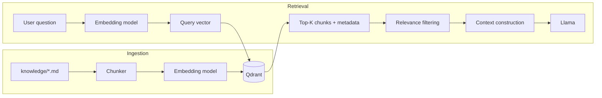
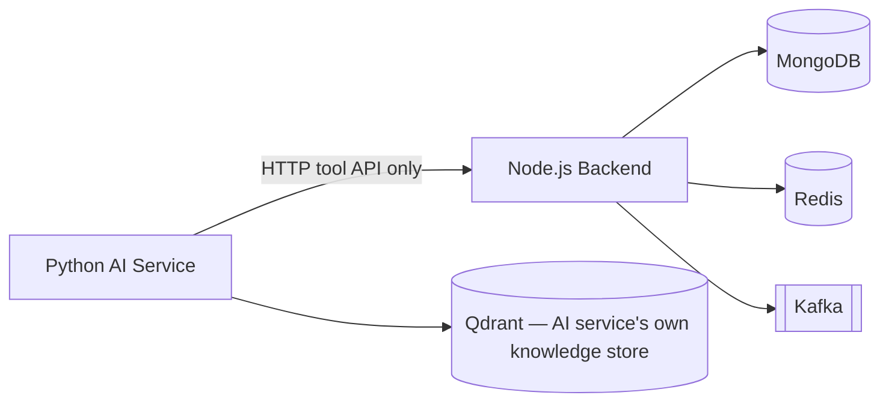

# Architecture — AI Digital Twin & What-If Simulation Platform

Status: living document, updated as each phase lands.
Last updated: Phase 1.

## 1. What this system is

The platform maintains an in-application **digital twin** of a small
distributed e-commerce system (User, Order, Payment, Inventory, Notification
services, their dependency graph, and simulated traffic/health/incident
data). An **agentic AI service** answers operational questions about that
twin — health, blast radius, bottlenecks, what-if scenarios, recovery
guidance — by combining:

1. **Live tool calls** against real application state (MongoDB/Redis-backed).
2. **Deterministic simulation** (plain application code, never the LLM) for
   any "what happens if X fails / traffic spikes" question.
3. **Retrieval-augmented generation** against a knowledge base of runbooks,
   architecture docs, and incident reports (Qdrant + embeddings).
4. An LLM (Llama, served via Groq) that plans which tools/RAG to use,
   interprets structured results, and produces a grounded explanation.

The LLM never invents numbers. It never simulates outcomes in its own
"head." Every quantitative claim in a response traces back to a tool call
whose result is logged in the agent's execution trace.

## 2. Component responsibilities

| Component | Responsibility | Responsibility it does NOT have |
|---|---|---|
| **React frontend** | Render system overview, topology, service detail, AI assistant chat, what-if simulation UI, incidents, agent execution trace | Never talks to Mongo/Redis/Kafka/Qdrant/Groq directly |
| **Node.js + Express backend** | Owns the digital twin's system-of-record: REST API, auth, MongoDB persistence, Redis caching, Kafka producing/consuming, deterministic simulation engine, tool endpoints the AI service calls | No LLM calls, no prompt construction, no embedding generation |
| **MongoDB** | Durable application/system data: services, topology, metrics history, incidents, users, agent execution traces | Not used for vector search |
| **Redis** | Cache-aside layer, current fast-changing service state, rate limiting, short-lived state | Not the system of record — nothing lives only in Redis |
| **Kafka** | Asynchronous events between producers/consumers inside the backend (service state changes, metrics ticks, incidents, simulation events, agent lifecycle events) | Not used for request/response traffic |
| **Python FastAPI AI service** | Agent orchestration loop, Groq/Llama calls, tool-calling, RAG retrieval (embedding + Qdrant), execution-state tracking, final response generation | Never touches MongoDB/Redis/Kafka directly — only via the backend's HTTP tool API |
| **Qdrant** | Vector similarity search over embedded knowledge-base chunks | Not a general-purpose database; stores no application/system data |
| **Groq (Llama)** | Reasoning, planning, tool selection, natural-language explanation | Never the source of truth for a number — only interprets numbers it's given |

## 3. Communication flow



Strict rule: **React never calls the AI service or Groq directly**, and the
**AI service never calls MongoDB/Redis/Kafka directly** — it goes back
through the backend's tool API. This keeps a single, auditable boundary
between "the system" and "the thing reasoning about the system."



## 4. Repository structure

```
ai-digital-twin/
├── frontend/               React + TypeScript + Vite
│   └── src/
├── backend/                Node.js + TypeScript + Express
│   └── src/
│       ├── config/
│       ├── models/         Mongoose schemas
│       ├── repositories/   Data-access layer
│       ├── services/       Business logic (digital twin, simulation engine)
│       ├── routes/         Express routers
│       ├── controllers/
│       ├── middleware/     auth, error handling, rate limiting, request-id
│       ├── kafka/          producers, consumers, topic definitions
│       ├── cache/          Redis client + cache-aside helpers
│       └── tools/          Internal HTTP endpoints the AI service calls as "tools"
├── ai-service/             Python + FastAPI
│   └── app/
│       ├── agent/          orchestration loop, planning, execution trace
│       ├── tools/          tool schemas + HTTP clients calling the backend
│       ├── rag/            chunking, embedding, Qdrant client, retriever
│       ├── llm/            Groq client, prompt templates
│       └── api/            FastAPI routers
├── knowledge/              Markdown source documents for RAG ingestion
│   ├── architecture/
│   ├── runbooks/
│   ├── incidents/
│   └── troubleshooting/
├── docs/                   This documentation set
├── tests/                  Cross-service / end-to-end tests
├── .gitignore
├── .editorconfig
└── README.md
```

Each service (`frontend`, `backend`, `ai-service`) is self-contained with
its own dependency manifest and its own `.env`. Nothing is duplicated
between them; shared concepts (e.g. the tool contract) are documented in
`docs/` rather than shared as code, since the two sides are different
languages.

## 5. Database responsibilities (MongoDB)

MongoDB is the system of record for the digital twin, reached only through
Mongoose from the Node.js backend. Planned collections (created starting
Phase 3/6):

- `services` — topology nodes: id, name, type, dependencies, dependents, current health snapshot
- `servicemetrics` — time-series-ish metrics samples (latency, error rate, traffic, capacity)
- `events` — service lifecycle / operational events
- `incidents` — created incidents (including agent-initiated ones, pending approval)
- `users` — accounts, roles (USER / OPERATOR / ADMIN)
- `agentexecutions` — full agent execution traces (question, steps, tool calls, RAG queries, retrieved docs, final response)

Indexes will be defined per access pattern (e.g. `services.name` unique,
`servicemetrics.{serviceId, timestamp}` compound, `agentexecutions.userId`
+ `createdAt`) when those collections are implemented in Phase 3/6/14 —
not guessed upfront.

## 6. Redis responsibilities

Redis is a real cache-aside layer and fast-state store, not a second
database:

- **Cache-aside** for read-heavy, slowly-changing data (e.g. topology,
  service metadata) with explicit TTLs.
- **Current service state** (health, last-seen metrics) so status reads
  don't hit MongoDB on every poll.
- **Rate limiting** for the public API and for the AI assistant endpoint
  (token-bucket or fixed-window counters).
- **Short-lived state**, e.g. in-flight simulation locks or agent
  execution progress markers.

Every cached key gets a documented reason and TTL in `docs/redis-strategy.md`
once Phase 4 defines the concrete keys. Nothing becomes "the only place a
piece of data lives" in Redis.

## 7. Kafka responsibilities

Kafka is for asynchronous, event-driven communication between producers
and consumers inside the backend — not for request/response traffic (that
stays REST). Planned topics:

| Topic | Purpose | Example producer | Example consumer |
|---|---|---|---|
| `service.events` | service state transitions (up/down/degraded) | simulation engine, health monitor | topology/state updater, notification |
| `system.metrics` | periodic metrics ticks per service | metrics generator | metrics aggregator (writes to Mongo, updates Redis) |
| `incidents` | incident created/updated | incident service, agent (privileged action) | notification, audit log |
| `simulation.events` | a what-if simulation was run | simulation engine | agent execution logger |
| `agent.events` | agent lifecycle (started, tool called, finished) | AI service (via backend) | execution trace writer |

Producers, consumers, consumer groups, partitioning/keys, retries and
dead-letter handling are implemented and explained concretely in Phase 5,
with a working producer → Kafka → consumer proof.

## 8. AI service responsibilities

The Python FastAPI service owns the agent loop end-to-end:

1. Receive a question (+ conversation/user context) from the backend.
2. Ask Llama (via Groq) what to do, offering it a fixed set of tool schemas.
3. Execute any tool calls by hitting the backend's tool API (read-only,
   simulation, or privileged — see §10).
4. Decide separately whether RAG retrieval is warranted; if so, embed the
   query, search Qdrant, filter for relevance, and construct context.
5. Feed tool results and/or retrieved chunks back to Llama.
6. Repeat until Llama produces a final answer or an iteration/timeout limit
   is hit.
7. Return the final answer plus a full execution trace to the backend for
   persistence.

## 9. Groq + Llama responsibilities

- The specific Groq-hosted Llama model is configured via `LLM_MODEL` (not
  hardcoded), with `LLM_PROVIDER=groq` making the provider explicit and
  swappable in principle.
- `GROQ_API_KEY` lives only in the AI service's server-side environment —
  never in React, never in the Node backend.
- The LLM's job is strictly reasoning, planning, tool selection, and
  explanation. It is never the source of a simulation number, a metric
  value, or a retrieved fact — those always arrive as tool/RAG results it
  is shown.

## 10. Tool-calling architecture

Tools are grouped by privilege, and the grouping is enforced, not just
documented:

1. **Read-only** — `get_services`, `get_service`, `get_dependencies`,
   `get_dependents`, `get_service_metrics`, `get_recent_events`,
   `get_incident_history`, `get_current_system_state`. Safe to call freely.
2. **Simulation** — `simulate_service_failure`, `simulate_traffic_increase`,
   `simulate_database_failure`, `simulate_cache_failure`,
   `calculate_blast_radius`, `find_bottleneck`. Read-only with respect to
   real system state — they compute hypothetical outcomes deterministically
   and never mutate anything.
3. **Privileged actions** — `recommend_scaling` (returns a recommendation,
   does not act), `create_incident` (mutates state). Privileged actions
   require explicit user/operator approval before execution; the agent can
   *propose* one but cannot silently execute it.

Every tool call, its arguments, and its result are recorded in the agent
execution trace (§18 concept, implemented Phase 14).

## 11. Simulation architecture

The deterministic simulation engine lives entirely in the Node.js backend
as plain TypeScript — no LLM involvement in the calculation itself:

```mermaid
flowchart LR
    Q["User question:\n'What happens if Payment Service goes down?'"] --> LLM[Llama]
    LLM -->|tool_call| TOOL[simulate_service_failure]
    TOOL --> ENGINE[Simulation Engine\n(deterministic TS, walks topology graph)]
    ENGINE --> RESULT[Structured result:\naffected services, cascading failures,\nestimated error-rate/latency impact]
    RESULT --> LLM2[Llama: interprets + explains]
```

The engine operates on the topology graph (§ digital twin, Phase 6) plus
current metrics to compute affected downstream services, cascading
failure likelihood, and estimated capacity/latency/error-rate impact.
Every simulation type (service failure, traffic multiplier, database
failure, cache failure, high latency, high error rate) is its own pure,
testable function with documented inputs/outputs — built out in Phase 7.

## 12. RAG architecture



Chunk size, overlap, and metadata schema (document id, chunk id, source
path, document type, related service, version/timestamp) are chosen and
justified concretely in Phase 12, once real runbook/incident documents
exist to chunk — not picked arbitrarily in advance.

## 13. Qdrant's role

Qdrant does exactly one job: vector similarity search over embedded
knowledge-base chunks. It is not a general application database (that's
MongoDB) and it is not a cache (that's Redis). The embedding model and
Qdrant are distinct components — the embedding model turns text into
vectors; Qdrant stores and searches those vectors.

## 14. Tool + RAG decision logic

The agent decides per-question whether it needs tools, RAG, both, or
neither, e.g.:

| Question | Decision |
|---|---|
| "What is the current Payment Service latency?" | Tool only |
| "What is the Payment Service recovery procedure?" | RAG only |
| "Payment Service is down. What should I do?" | Tool + RAG |
| "What happens if Payment Service fails?" | Simulation tool |
| "Explain what a circuit breaker is." | Neither — LLM's own knowledge suffices |

This decision is made by the LLM itself via the tool-calling interface
(it can choose to call zero, one, or several tools, and separately choose
whether to issue a RAG query) rather than a separate hardcoded classifier,
consistent with using one orchestrator agent instead of a multi-agent
system.

## 15. AI service / backend boundary



The AI service has no MongoDB/Redis/Kafka client at all — it is
structurally impossible for it to bypass the backend's tool API, which
means every piece of live data the agent sees has already passed through
the backend's validation/auth/business logic.

## 16. Agent execution trace (concept)

Persisted per invocation (implemented Phase 14): `executionId`, `userId`,
`question`, `status`, ordered `steps` (each a tool call, tool result, RAG
query, or simulation run with timestamps), `retrievedDocuments`,
`finalResponse`. The frontend's "Agent Execution Trace" view (Phase 17)
renders this as a timeline so the platform demonstrates *how* the agent
reached its answer, not just the answer.

## 17. Security & reliability posture (implemented Phases 15–16)

- JWT authentication + RBAC (`USER`, `OPERATOR`, `ADMIN`); privileged tools
  require `OPERATOR`/`ADMIN` and explicit approval.
- Secrets (Mongo/Redis/Kafka credentials, `GROQ_API_KEY`) are server-side
  environment variables only, never sent to the frontend.
- Reliability patterns (timeouts, retries with backoff, circuit breaker,
  rate limiting, idempotency, Kafka retry/DLQ, AI iteration limits, AI tool
  timeouts) are added where they solve a concrete, identified failure mode
  — not speculatively.

## 18. Testing strategy (overview — detailed per phase)

- **Node.js**: Vitest for unit tests (services, simulation engine,
  repositories), Supertest for API integration tests against a real local
  MongoDB/Redis where practical; `mongodb-memory-server` may be used for
  *isolated* test runs only, never in production code paths.
- **Python**: pytest for agent logic, tool clients (mocked backend), RAG
  retrieval, and Groq client wrapper (mocked + a real "smoke" call kept
  separate from CI-run unit tests).
- **Integration**: producer→Kafka→consumer proofs, Mongo/Redis connectivity
  health checks, Qdrant ingest→search proofs, end-to-end "question → agent
  → grounded answer" tests in `tests/`.
- Every "prove it works" requirement in this project (§ Verification-First
  Development below) has a corresponding automated test, not just a manual
  check performed once.

## 19. Local development prerequisites

See the root `README.md`. Summarized: Node 20 LTS, Python 3.11+, local
MongoDB, Redis, Kafka, and Qdrant processes, and a Groq API key. No Docker,
no Kubernetes, for now — each dependency is understood as a standalone
local process first.

## 20. Environment variables

See [`env-vars.md`](env-vars.md) for the full list across all three
services, with `.env.example` files provided per service.

## 21. Verification-first development

For every infrastructure dependency introduced in a phase, that phase does
not conclude until there is a runnable proof, not just configuration:
MongoDB (insert → read), Redis (SET → GET → verify TTL), Kafka (producer →
topic → consumer receives), Qdrant (embed → upsert → search → verify
relevant hit), Groq (call → verify real completion), tools (LLM → tool →
real application data → tool result → LLM), RAG (question → embed →
search → retrieved chunks → grounded answer). These proofs become the
phase's test suite, not one-off manual checks.
